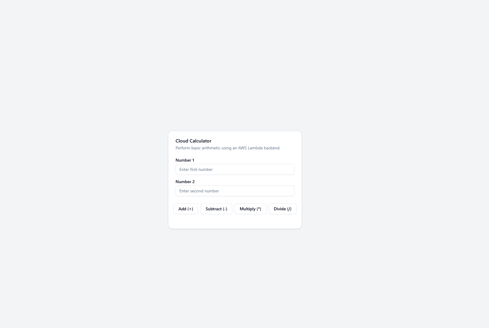

# COE 558 Cloud and Edge Computing Assignment: Cloud Calculator

This repository contains a simple web application that performs basic arithmetic operations on two numbers. It fulfills the requirements of **COE 558: Cloud and Edge Computing** (56 pts total).

---

## Table of Contents

1. [Assignment Overview](#assignment-overview)
2. [Features](#features)
3. [Architecture](#architecture)
4. [Prerequisites](#prerequisites)
5. [Setup & Installation](#setup--installation)

   * [Backend (AWS Lambda)](#backend-aws-lambda)
   * [Frontend (React)](#frontend-react)
6. [Usage](#usage)

   * [API Endpoints](#api-endpoints)
   * [Running Locally](#running-locally)
7. [Error Handling](#error-handling)
8. [Screenshots](#screenshots)
9. [Grading Breakdown](#grading-breakdown)
10. [License](#license)

---

## Assignment Overview

You are required to develop a simple web application that conducts arithmetic operations on two numbers and displays the result. The application is split into two components:

1. **Backend (32 pts)**
2. **Frontend (24 pts)**

Both components are implemented using serverless technologies and modern frameworks.

## Features

* **Backend**

  * Single RESTful API endpoint (`/calculate`) handling **add**, **subtract**, **multiply**, and **divide** operations.
  * Supports **GET** and **POST** requests.
  * Returns input numbers, operation, and result in JSON.
  * Graceful error handling for:

    * Division by zero
    * Unsupported HTTP methods
    * Invalid or missing parameters

* **Frontend**

  * Single-page React application.
  * Two input fields for numbers.
  * Four buttons (Add, Subtract, Multiply, Divide).
  * Displays result or error message.
  * Calls the backend API for all calculations.

## Architecture

```text
┌────────────┐      HTTPS       ┌──────────────────────────────┐
│ React App  │ ───────────────> │ AWS API Gateway (CORS enabled)│
│ (frontend) │                 └──────────────────────────────┘
└────────────┘                           │
                                         ▼
                                 ┌────────────────┐
                                 │ AWS Lambda     │
                                 │ calculate      │
                                 └────────────────┘
```

* **Backend**: AWS Lambda function written in Python, exposed via API Gateway.
* **Frontend**: React (Vite) with shadcn/ui components, running locally or deployable to any static hosting.

## Prerequisites

* **AWS Account** with permissions to create Lambda and API Gateway
* **Node.js** (v16+) and **npm** or **yarn**
* **AWS CLI** configured locally (optional, for deployments)

## Setup & Installation

### Backend (AWS Lambda)

1. **Clone the repo** and navigate to the `backend/` folder:

   ```bash
   ./lambda.py
   ```

### Frontend (React)

1. **Navigate** to the `frontend/` folder:

   ```bash
   cd frontend
   ```
2. **Install** dependencies:

   ```bash
   bun install
   # or
   npm install
   ```
3. **Configure** the API endpoint in `src/App.tsx`:

   ```ts
   const API_ENDPOINT = '<your-api-gateway-url>/calculate';
   ```
4. **Start** the development server:

   ```bash
   npm run dev
   # or
   yarn dev
   ```
5. Open your browser at `http://localhost:5173`.

## Usage

### API Endpoints

| Method | URL                                      | Body / Query Params                                     | Response                                                        |
| ------ | ---------------------------------------- | ------------------------------------------------------- | --------------------------------------------------------------- |
| GET    | `/calculate?num1=5&num2=3&operation=add` | n/a                                                     | `{ num1: "5", num2: "3", operation: "add", result: "8" }`       |
| POST   | `/calculate`                             | `{ "num1": "5", "num2": "3", "operation": "multiply" }` | `{ num1: "5", num2: "3", operation: "multiply", result: "15" }` |

### Running Locally

1. Start the **backend** (if testing locally) with a Lambda emulator (optional).
2. Run **React** frontend:

   ```bash
   cd frontend
   npm run dev
   ```
3. Enter two numbers and click an operation button.
4. View result or error.

## Error Handling

* **Division by zero** returns HTTP 400 with message:

  ```json
  { "error": "Division by zero is not allowed.", ... }
  ```
* **Invalid HTTP method** returns HTTP 405.
* **Missing or invalid parameters** return HTTP 400 with descriptive message.

## Screenshots

*Example UI:*



## Grading Breakdown

* **Backend (32 pts)**

  * Single endpoint covering four operations (8 pts)
  * GET & POST support (8 pts)
  * JSON request & response format (8 pts)
  * Error handling: division by zero, unsupported methods (8 pts)

* **Frontend (24 pts)**

  * Single-page UI with two inputs (6 pts)
  * Operation buttons (6 pts)
  * API integration (6 pts)
  * Result/error display (6 pts)

Total: **56 pts**

## License

This project is provided for academic use in **COE 558: Cloud and Edge Computing** 
